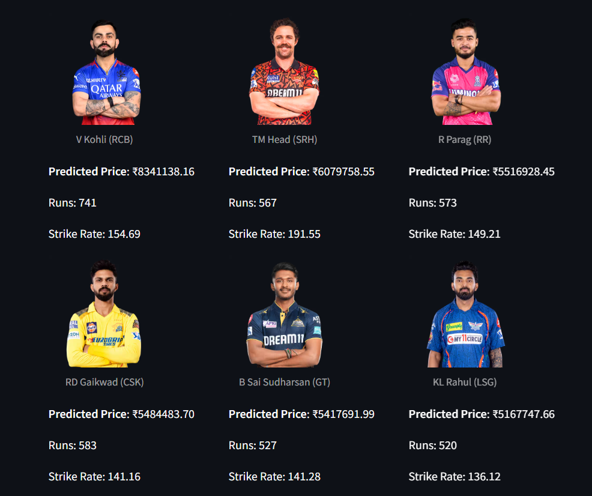
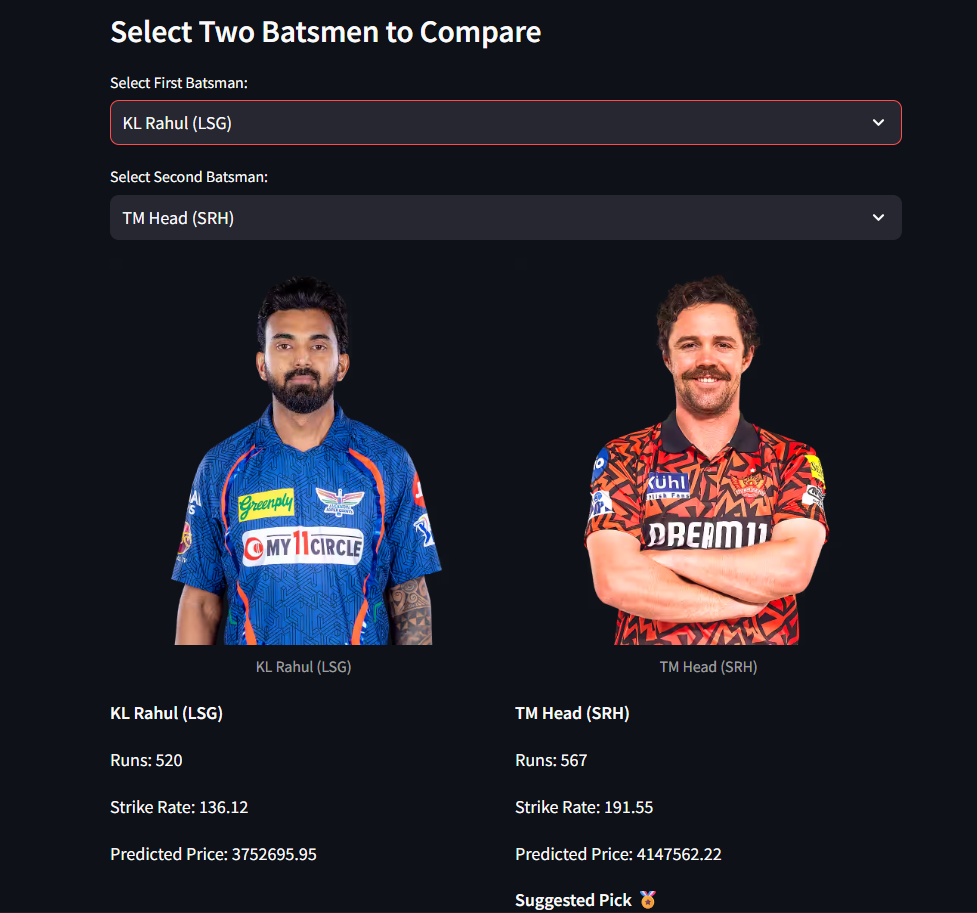
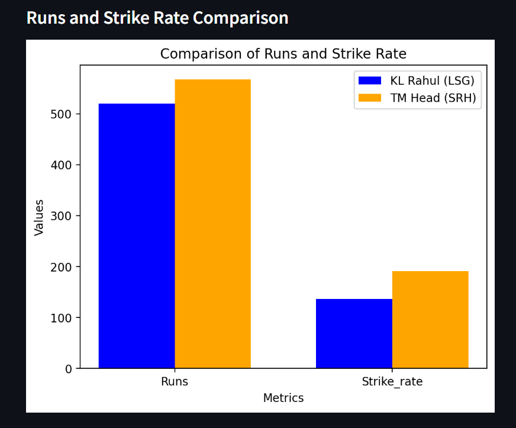
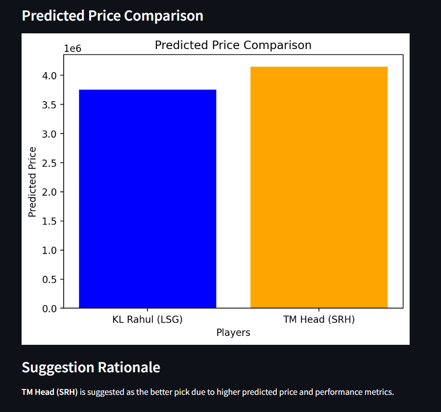
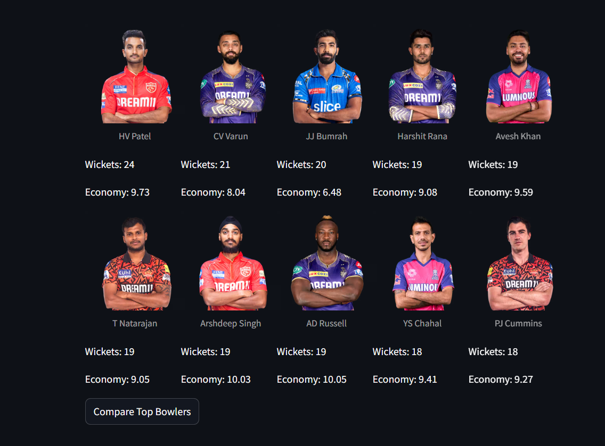
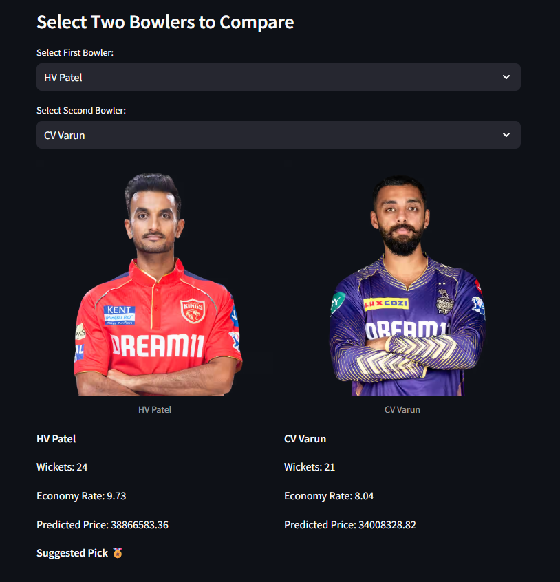

# 🏏 IPL Player Price Prediction App

Developed a Streamlit-based web application to predict IPL player prices using Linear Regression. Implemented data extraction from ESPN Cricinfo via BeautifulSoup for accurate, real-world statistics. The app enables graphical comparisons between players and identifies top-performing batsmen and bowlers based on performance metrics.<br>

You can access the deployed app here:  [Cricket Player Price Prediction App](https://cricketplayerpriceprediction.streamlit.app/)

---

## 📊 Features

- 🔐 Login System (Simple credential-based access)

- 🧮 Batting Price Prediction using:

    - Runs
    - Strike Rate
    - Matches
    - Innings
    - Batting Average

- 🎯 Bowling Price Prediction using:

    - Wickets
    - Matches
    - Innings
    - Bowling Average

- 📊 Comparison Dashboard:
    - Compare two top players (Batting or Bowling)
    - View insights through interactive bar charts
    - Automatic suggestion of the better pick based on predicted price and performance metrics 

---

## 🧩 Tech Stack

| Component | Technology Used |
|------------|-----------------|
| **Frontend / UI** | Streamlit |
| **Backend** | Python |
| **Data Extraction** | BeautifulSoup (Web Scraping) |
| **Machine Learning** | Scikit-learn (Linear Regression) |
| **Data Storage** | CSV |
| **Visualization** | Matplotlib / Plotly |

---

## 🧮 How It Works

1. **Data Extraction**  
   - Player stats are scraped from [ESPN Cricinfo](https://www.espncricinfo.com) using BeautifulSoup.  
   - Data is cleaned and stored in CSV format (`/data/Batting_records.csv`, `/data/Bowling_records.csv`).

2. **Model Training**  
   - Linear Regression is used to predict performance based on past records (runs, averages, strike rate, economy, wickets, etc.).  
   - The trained model can be serialized using `joblib`.

3. **Prediction & Visualization**  
   - User selects between **Batting** or **Bowling** prediction.  
   - Top 10 players are shown with stats and images.  
   - Comparison graphs display performance insights.

---

## ⚙️ Installation

```bash
# Clone the repository
git clone https://github.com/Jeeva-5657/Cricket_Player_Price_Prediction.git
cd Cricket_Player_Price_Prediction

# Install dependencies
pip install -r requirements.txt

# Run the app
streamlit run src/cricket.py
```
## Credentials
```plaintext
Username: admin
Password: password123
```
## Attachments
### Batting Screenshots
<p align="center">
  
  <br>
  
  
</p>

----

### Bowling Screenshots
<p align="center">
  
  <br>
  
  
</p>

## 📈 Future Enhancements

- ✅ Add All-Rounder Predictions
- 🔜 Use more advanced ML algorithms (Random Forest, XGBoost)
- 🔜 Add live data updates from ESPN
- 🔜 Enhance UI with animations and charts

## 💡 Acknowledgments
- [ESPN Cricinfo](https://www.espncricinfo.com/) for player statistics
- [Scikit-learn](https://scikit-learn.org/stable/) for ML model training
- [Streamlit](https://streamlit.io/) for an easy web app framework

## 🌐 Connect
- Author : Jeeva Vadivel
- Email : jeevavadivel01@gmail.com
- Github : [Jeeva-5657](https://github.com/Jeeva-5657)
- LinkedIn : [Jeeva Vadivel](https://www.linkedin.com/in/jeeva-vadivel/)
